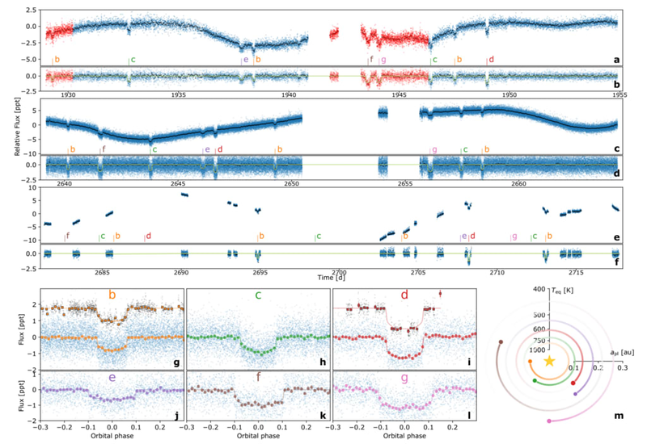

# Exoplanetary science = Data science
The vast majority of exoplanetary science is, in fact, **data science**.[+]
- API/SQL database access[+]
- Regression & classification[+]
- Model building, optimising, sampling.[+]
- Data visualisation[+]
-v-

## Most problems in observational astronomy can be thought of in the following way:
1) Imagine a **hypothesis** (transit, supernova, etc)[+]
2) Create a **parameterised model** translating physics into observables[+]
3) Take **observations** (+ "reduce" them, e.g. remove systematic noise)[+]
4) **Fit** the model to the observations[+]
5) **Sample** the parameters to derive uncertainties[+]
6) Use **model comparison** to test whether the hypothesis is justified[+]

---
# Introducing myself

I try to find _transiting exoplanets_ using data from space telescopes (e.g. TESS), and then I confirm & characterise them using ground-based telescopes.

Most interesting recent example, **HD110067**, a resonant chain of 6 planets which I discovered

-v-

---
## Introducing you!

##### Tell us:
- Name
- Rough experience level at coding
- What's your favourite planet (and why)?

---
# We learn by _doing_.
- I will usually provide one bare-bones examples which require _thinking_ to complete a simplified version.[+]
- With this knowledge in hand, we can see how existing astronomical software runs and apply to some real data[+]
- There will be multiple examples provided[+]

-v-

# We learn by _showing_
- For each topic, each of you will create a short (<10 minute, ~5 slide) presentation each of which will be worth ~7.5% of the total credit[+]
- There will also be a presentation of the final project.[+]

---

# 2-week structure:
- *Monday 16:00*: presenting previous week's project
- *Monday 17:00*: Introduction to new subject (slides)[+]
- *Tuesday 09:00*: Introduction to simple code (python)[+]
- _1 week take-home playing with code/data/etc._[+]
- *Monday 16:00-18:00*: Advanced coding sessions (python)[+]
- *Tuesday 09:00*: Open door policy for specific questions[+]
- _1 week take-home finalising analysis & presentation._[+]

-v-

# Assessment:
- 0.5% for attendance at each session (total: 10%)[+]
- 45% from small projects (7.5% each)[+]
- 35% from a focussed final project (20% report, 15% presentation)[+]

-v-

## LLM/AI ethics

- Generative AI is the most useful coding support
- Use it for technical support (_Why is my code crashing?_)[+]
- Do not use it to **replace understanding** (_Build me an interior structure EoS_)[+]
- You will have to demonstrate understanding in presentation questions.[+]

-v-

## Peer support

- Is welcome. Please help out others!
- But project/presentations should be **individudal**[+]

---
# Topics
wk 1) Intro (installation, stats/coding refresher)[+]
2+3) Stars (Gaia)[+]
4+5) Transiting Planets[+]
6+7) Radial Velocities[+]
8+9) Interior structures[+]
10+11) Exoplanetary Imaging[+]
12+13) JWST atmospheric spectroscopy[+]

-v-

### Links to other researchers
- CHEOPS instrument team (transit photometry)[+]
- Yann Alibert & Christoph Mordasini - Interior structure modelling[+]
- Jonas Kuhn - Imaging & instrumentation (e.g. PLACID)[+]
- Brice Demory & Daniel Kitzmann - atmospheric spectroscopy[+]

For masters projects, hopefully these projects from a useful intro![+]

-v-

# Final project
Take a deep-dive into astronomical data, and write-up a ~10 page report (due late January 2027).

Can go into deeper detail into any of the topics covered, or combine some of them (e.g. transits+ RVs + interior modelling).[+]

---

# Questions?

Feel free to reach out:
- via email (`hugh.osborn@unibe.ch`)
- at my office (G6 EG.018).
