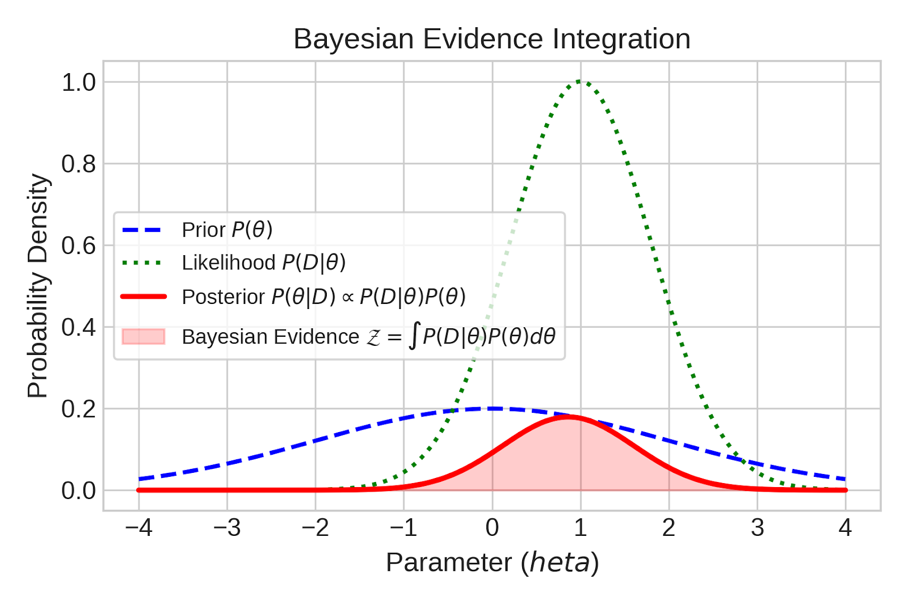

# Introduction to exoplanets, python, data, coding, statistics, etc

We will use some data from the NASA exoplanet archive for this.

Please open `all_code/coding_referesher_example.py` in Zed[+]

-v-
## Course Roadmap
- **Data Acquisition:** Querying NASA Exoplanet Archive via TAP [+]
- **Visualisation:** Best practices & multidimensional population plots [+]
- **Modeling & Optimization:** Linear/quadratic fits via Scipy [+]
- **Priors & Likelihood:** Constructing the Bayesian Posterior [+]
- **Model Comparison:** $\chi^2$, BIC, and WAIC [+]
- **MCMC Sampling:** Posterior exploration using `emcee` [+]
- **Code Crafting:** OOP, modular structure & testing [+]

---

# 1. Accessing Astronomical Data
- Frequently, we will access APIs from directly within python.[+]
- This is most frequently done wit `astroquery` [+]
- For this example, we will access the **[NASA Exoplanet Archive](https://exoplanetarchive.ipac.caltech.edu/)** TAP interface  via `astroquery.ipac.nexsci.nasaexoplanetarchive`[+]
  - Likely need to filter out planets with highly uncertain parameters/nan values [+]
  - Prefer standard tabular formats (`astropy.table` / `pandas.DataFrame`) [+]
-v-
## Querying Transit Planet Population - SQL direct
```python
from astroquery.ipac.nexsci.nasaexoplanetarchive import NasaExoplanetArchive

query = """
SELECT pl_name, pl_rade, pl_radeerr1, pl_bmasse, pl_bmasseerr1, 
       pl_eqt, st_metratio
FROM ps
WHERE default_flag = 1 
  AND tran_flag = 1
  AND pl_rade IS NOT NULL 
  AND pl_bmasse IS NOT NULL
"""
data = NasaExoplanetArchive.query_criteria(select=query)
```

-v-
## Querying Transit Planet Population - Function

```
from astroquery.ipac.nexsci.nasaexoplanetarchive import NasaExoplanetArchive

cols="pl_name,pl_rade,pl_radeerr1,pl_bmasse,pl_bmasseerr1,pl_eqt,sy_vmag,sy_gaiamag,st_mass,st_teff,st_rad"

wh="default_flag=1 AND tran_flag=1 AND pl_rade IS NOT NULL AND pl_rade > 0 AND pl_bmasse IS NOT NULL AND pl_bmasse > 0 AND pl_bmasseerr1 IS NOT NULL AND pl_bmasseerr1 > 0 AND pl_radeerr1 IS NOT NULL"

table = NasaExoplanetArchive.query_criteria(table="ps", where=wh, select=cols)
```

---

# 2. Visualisations
## What Makes a Great Publication Plot?
- **Perceptually Uniform Color Maps:** Use `viridis`, `magma`, `plasma` (avoid `jet`) [+]
- **Accessibility:** Ensure high contrast and colorblind safety [+]
- **Self-Contained Labels:** Clear physical units on all axes (e.g., $R_\oplus$, $M_\oplus$, $K$) [+]
- **Data-to-Ink Ratio:** Avoid unnecessary grids, borders, or chartjunk [+]

-v-
## Your turn - the planetary population in multiple dimensions
- Using matplotlib, 
- **X-axis:** Planetary Mass ($M_\oplus$) [+]
- **Y-axis:** Planetary Radius ($R_\oplus$) [+]
- **Color (cmap):** Planetary Equilibrium Temp ($T_{\text{eq}}$) [+]
- **Marker Size:** Stellar Magnitude ($V$ or $K$) [+]
- Try other parameters (e.g. period, temperature, stellar radius, etc)[+]
- Try other plot types, e.g. a 2D kernel density estimation (KDE) with `seaborn`[+]

-v-

```
scatter = ax.scatter(df['pl_bmasse'],df['pl_rade'],
            c=np.log10(df['pl_eqt']),
            s=(15 - df['sy_vmag'].clip(upper=15)) * 15 + 20, cmap='viridis', alpha=0.8, edgecolors='k',linewidth=0.5
        )
cbar = fig.colorbar(scatter, ax=ax)
cbar.set_label(r'$\log_{10}(\text{Teff } [K])$')
ax.set_xlabel(r'Mass $M_{\text{Earth}}$ [$M_\text{Earth}$]')
ax.set_ylabel(r'Planetary Radius $R_\oplus$ [$R_\text{Earth}$]')
ax.set_title('Sub-Neptune Population Overview')
ax.grid(True, linestyle='--', alpha=0.5)
plt.show()
```

---

# 3. Building parametric models
#### Example - Mass-Radius Relation
- Planetary compositions mean $R$ and $M$ should correlate...[+]
- Let's try to build a parametric model for exoplanet mass (specifically for _sub-Neptunes_ with $1.8 \le R_\oplus \le 6.0$)[+]
- **Simplifying Assumption:** Radius $R$ is known precisely ($\sigma_R \ll \sigma_M$) [+]

-v-
### Your turn: Building a parametric model in python
- Create functions that, given a radius and a list of parameters (the polynomial coefficients) produces an expected mass.[+]
- Model 1 (Linear): $\ln(M) = a \ln(R) + b$ [+]
- Model 2 (Quadratic): $\ln(M) = c_2 \ln(R)^2 + c_1 \ln(R) + c_0$ [+]

-v-
```
def linear_model(theta, x):
    # Define a linear model from parameter array theta
    a, b = theta
    return a * x + b
def quadratic_model(theta, x):
    # Define a quadratic model from parameter array theta
    a, b, c = theta
    return a * x**2 + b * x + c
```

---

# 4. Model optimisation

- We want to find the parameters which best fit the data [+]
- The probability distribution for a datapoint, $y_i$, normally distributed from some model value $f(x)$, is $P(y_i | f) = \frac{\exp(-(y_i-f(x_i))^2/2\sigma_i^2))}{\sqrt{2\pi}\sigma_i}$ [+]
- The "likelihood" is the probability of obtaining your data $y$ given the model $f$ and the fixed observed values of $x_i$ and $\sigma_i$ $\mathcal{L} = P({y}^N_{i=1} | f, I) = \prod_{i=1}^N P(y_i | f) $ [+]
- The "log likelihood" remove the exponential term giving: $\ln \mathcal{L} = K - \sum_{i=1}^N\frac{(y_i-f(x_i))^2}{2\sigma_{yi}^2} = K - \frac{1}{2}\chi^2 $ [+]

-v-

### Your turn: Assessing log likelihood
- Create a function which can compute the log likelihood for your example function [+]
-v-
```
def log_likelihood(theta, x, y, yerr, model=linear_model, **kwargs):
    """
    Gaussian log likelihood.
    """
    ymodel = model(theta, x)
    log_lik = -0.5 * np.sum(((y - ymodel) / yerr)**2 + np.log(2 * np.pi * yerr**2))
    return log_lik
```
-v-

## Optimization: Gradient Descent vs. Direct Search
- **Best-Fit Search:** Finding parameter set $\widehat{\theta}$ that maximises log likelihood. [+]
- **Gradient Descent:** Steps downhill using local "slope" in likelihood, efficient for high dimensions [+]
- **Nelder-Mead:** Simplex direct search, useful when gradients are noisy or unavailable [+]
-v-


-v-
## Frequentist Metrics: $\chi^2$ & BIC
- **$\chi^2$ Minimization:** $\chi^2 = \sum \frac{(y_i - f(x_i, \theta))^2}{\sigma_i^2}$ [+]
  - For well-behaved gaussian distributions, maximising log likelihood is equivalent to minimising $\chi^2$.[+]
  - **Reduced $\chi^2$ ($\chi^2_\nu$):** $\chi^2 / (N - k)$ [+]
- **Bayesian Information Criterion (BIC):** [+]
  $$\text{BIC} = k \ln(N) - 2 \ln(\widehat{L}) \approx \chi^2 + k \ln(N)$$ [+]
  - $\Delta\text{BIC} > 10$ indicates strong evidence against the higher-BIC model [+]

-v-

#### Your turn: model comparison 

- Compute the BIC for the two models (linear and quadratic)
- Which model is preferred?
 
-v-

```
def BIC(loglik,n_params,nsamps):
    return 2 * loglik + n_params * np.log(nsamps)
```

---

# 5. Bayesian Priors & Posterior Formulation
- We usually have information about our parameters - **priors** [+]
  - This could be from past observations or theoretical considerations[+]
-v-
- To compute the most likely model given the datapoints and the priors, we use Bayes theorem: $ P(f | {y}^N_{i=1}, I) = \frac{P({y}^N_{i=1} | f, I) P(f | I)}{P({y}^N_{i=1} | I)}$:[+]
  - The likelihood function $P({y}^N_{i=1} | f, I)$ [+]
  - Our prior knowledge on model parameters $P(f | I)$ [+]
  - $P({y}^N_{i=1} | I)$ - the probability of datapoints given their position and error (Typically this constant and can be ignored.)[+]

-v-
## Types of Prior
- **Uniform (Flat) Priors:** 
  - Restricts parameters to physically allowed ranges (e.g., positive mass/slope) [+]
  - Gives equal probability to all values within bounds, 0 outside [+]
- **Gaussian (Informative) Priors:**
  - Incorporates previous measurements (e.g., stellar abundance or known inclination) [+]
  - Penalizes parameter values as they move further from the expected mean [+]

-v-

#### Your turn: Adding a prior function

- Add a function which, given priors for each parameter, adds a log prior term (e.g. ensures the gradient is uniformbetween 0 and 5)[+]
- Log likelihood & log prior can then produce a combined **log probability** term for gradient descent.[+]

-v-

```
def log_prior_linear(theta):
    """
    Calculates log prior using a combination of:
    1. Uniform prior on slope 'a' (must be physical: 0 < a < 5)
    2. Gaussian prior on intercept 'b' centered on 0.5 with sigma=2.5
    """
    a, b = theta
    
    # 1. Uniform Prior component
    if not (0.0 < a < 5.0):
        return -np.inf  # Reject parameters outside range
    
    # 2. Gaussian Prior component: log N(b | mu=0.5, sigma=1.0)
    mu_b, sigma_b = 0.5, 5.0
    log_prior_b = -0.5 * ((b - mu_b) / sigma_b)**2 - np.log(sigma_b * np.sqrt(2 * np.pi))
    
    return log_prior_b
```
  
---

# 6. MCMC & Sampling
## Posterior Exploration
- Single best-fits ignore parameter uncertainties and complex parameter trade-offs [+]
- **Markov Chain Monte Carlo (MCMC):** Explores the full probability distribution $P(\theta|D)$ [+]
- Uses **Metropolis** algorithm to [step around parameter space](https://chi-feng.github.io/mcmc-demo/app.html?algorithm=RandomWalkMH&target=standard). [+]
- **Ensemble Samplers (`emcee`):** Uses multiple interconnected "walkers" to map parameter space [+]

-v-

#### Your turn: running emcee

- Use emcee and your log probaility term to sample the parameters and their values [+]
- Use the `corner` module to plot the sampled parameter estimates [+]

-v-

- **Bayesian Evidence ($\mathcal{Z}$):** Integral of Likelihood $\times$ Prior over all parameters [+]
  $$\mathcal{Z} = \int P(D|\theta) P(\theta) d\theta$$ [+]
[+]

-v-

**Advanced Samplers:**
  - **HMC / NUTS (`PyMC`):** Uses gradient physics to navigate high-dimensional spaces ([e.g.](https://chi-feng.github.io/mcmc-demo/app.html?algorithm=EfficientNUTS&target=banana)) [+]
  - **Nested Sampling (`dynesty`, `ultranest`):** Integrates shell-by-shell to directly compute $\mathcal{Z}$ [+]
-v-

## MCMC Diagnostic Checklist
1. Inspect trace plots for convergence and initial burn-in phase [+]
2. Check Integrated Autocorrelation Time ($\tau$) [+]
3. Target total sample size $\gg 50 \times \tau$ [+]
4. Plot corner distributions to reveal parameter correlations [+]

---

# 7. Advanced Model Selection
## Information Criteria with `ArviZ`
- Simple $\chi^2$ and BIC fail when priors strongly constrain parameters or parameters correlate [+]
- **Watanabe-Akaike Information Criterion (WAIC):** Fully Bayesian metric predicting out-of-sample data accuracy [+]
- **LOO (Leave-One-Out Cross-Validation):** Estimates model generalization error without needing to re-fit [+]

---

# 8. Software Architecture in Astrophysics
## Code Organization Hierarchy
- **Scripts:** Quick data processing (hard to reuse or test) [+]
- **Functions:** Modular, single-responsibility logic with clear docstrings [+]
- **Classes:** Object-oriented code grouping data, models, and fitting methods together [+]
-v-
## Production-Grade Python Tips
- **Type Hinting & Docstrings:** Makes code readable and self-documenting [+]
- **Unit Testing (`pytest`):** Automatically catches numerical bugs and regressions [+]
- **Version Control:** Git history for reproducible scientific workflows [+]
