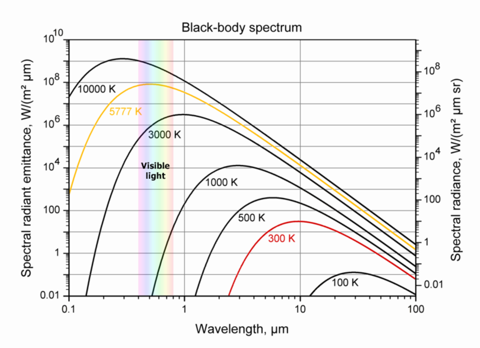
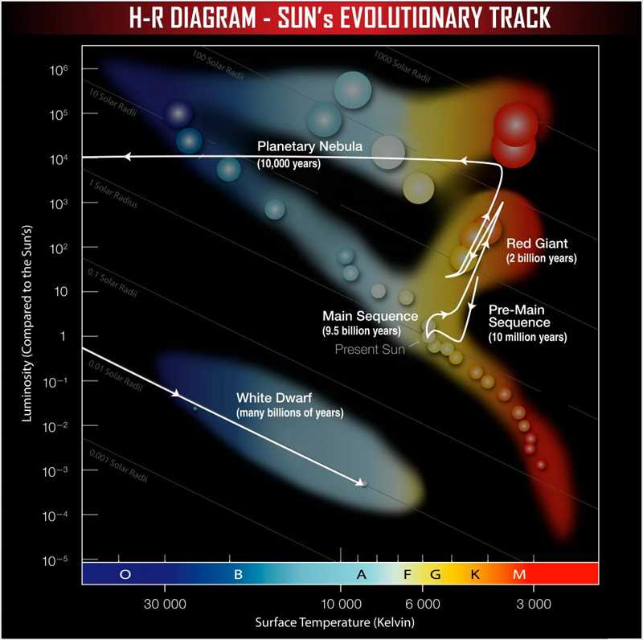
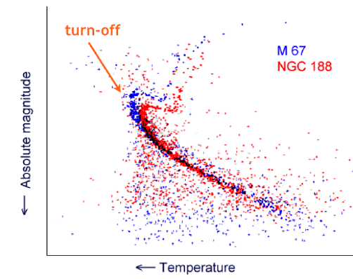
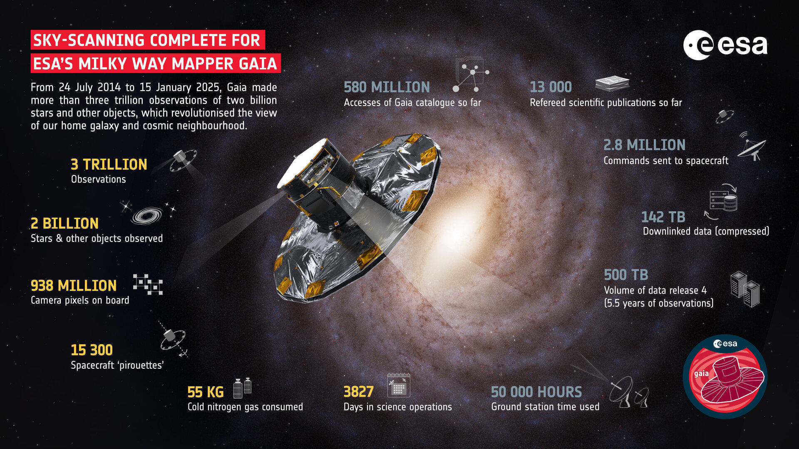
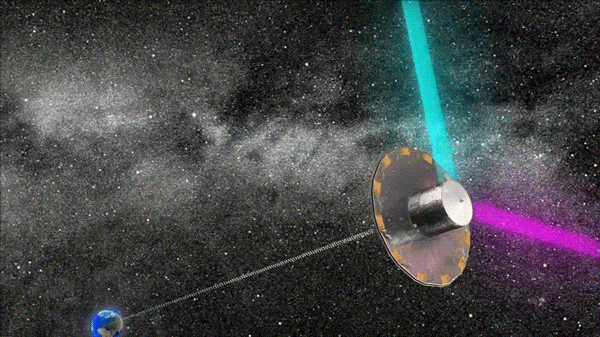
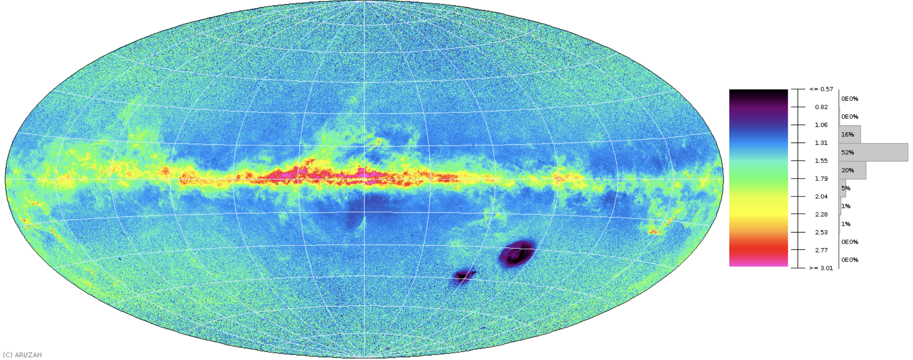

### The fundament problem:

99.9999% of stars in our galaxy cannot be resolved by human telescopes

We must learn about them **using their light alone**.[+]

-v-

## Brightness & colour

Survey telescopes can measure the apparent brightness of all stars in the sky.[+]

Typically we use a log relative magnitude scale defined by the star _Vega_ ($m_{\rm Vega}=0.0$).[+]

Faint stars have higher magnitudes (e.g. $m_{{\rm proxima, V}} = 11.13$)[+]

Measurements in different filters (e.g. B & V) produce colours[+]

e.g. $ \left( B - V \right) \_{\rm Vega} = 0.0 $ ; $ \left(\rm{B}-\rm{V}\right) \ _{\rm Proxima}=1.82 $[+]

-v-

## Brightness & colour

The apparent magnitude of a given stars is determined by :

1) *Intrinsic luminosity*[+]
    - Often encapsulated as an "Absolute Magnitude"[+]
    - This is the magnitude a star would have at a distance of 10pc[+]
2) *Distance from us*[+]
    - The inverse square law of light reduces flux[+]

Two stars could appear the same brightness but be orders of magnitude apart in luminosity & distance.[+]

---

## Distance

Close one eye; hold out thumb and place over target; switch eyes: **parallax** [+]

-v-

## Distance

Parallax is defined as the observed angular displaced of a star from the 1AU displacement of Earth.[+]

If we measure some displacement angle $\pi$ relative to (more or less fixed) background stars, then what is the distance to the star?[+]

$$
\tan{\pi} = 1{\rm au}/d
$$[+]

Given that angles are small ($\tan{\theta} \approx \theta$ in radians) and the parsec is defined as the distance which causes a 1 arcsec displacement:[+]

$$
\pi/\rm{arcsec} = \rm{pc}/d
$$[+]

[q] What is the parallax of a star at the galactic core (8000 pc)? [+]

---

## Motion

Measuring a star's position precisely over many years may also reveal a star's real movement too - its **proper motion**.

[+]

Combined with distance & radial velocity (e.g. from spectroscopy), we get a stars position in 6 dimensions (3D position + 3D motion).[+]

---

## Surface temperature

Stellar colours are most fundamentally related to stellar surface (or _effective_) temperature (e.g. Wien's law):

-v-

## Luminosity

If a star has distance $d$ and magnitude $m_V$, we can estimate its luminosity.

1) Get a filter-specific absolute magnitude using the "distance modulus":
$$m_V - M_V = 5 \log_{10}{d} - 5 \qquad \rm{ or } \quad M_V = m_V-5\log_{10}{d}+5$$[+]

However, luminosity is _bolometric_ (i.e. summed across all wavelengths), so we have to adjust using a **bolometric correction**.[+]

$$M_{\rm bol} = m_V-5\log_{10}{d} + 5 + BC$$[+]

This changes as a function of temperature (blue & red stars require higher corrections as they radiate less in the V band than the Sun)[+]

-v-

## Luminosity

We can use the fact that the magnitude scale is _base 2.5_ to calculate the relative difference in luminosity between a star and the Sun (Which has $M_{\rm{bol},\odot} = 4.74$).[+]

$$L = L_\odot  10^{0.4\left(M_{\rm{bol},\odot} - M_{\rm{bol}}\right)} \\quad \rm{or} \quad \log_{10}{\left(\frac{L}{L_\odot}\right)} = 0.4(M_{\rm{bol},\odot} - M_{\rm{bol}})$$[+]

-v-

## Stellar radius

Given the Stephan-Boltzmann law of black body radiation:

$$L = 4\pi R_s^2 \sigma T^4$$[+]

We can rearrange for R, such that:[+]

$$R_s = \sqrt{\frac{L}{4\pi \sigma T^4}}$$[+]

Hence, with an established distance, magnitude and temperature we can estimate a stellar radius.[+]

---

## Other quantities:

**Surface gravity** can be estimated via absorption line width in spectra[+]

 **Stellar mass** is typically the least well-established physical quantity:[+]
- Can be calculated from radius \& gravity[+]
- Often best constraints from stellar evolution models[+]

**Age** is very difficult to determine. Possibilities:[+]
- Stellar rotation speed (Gyrochronology - older stars rotate slower)[+]
- Asteroseismology (vibration probes interior structure)[+]
- Stellar evolution models (stars change with time, e.g. density)[+]

---

# Stellar evolution

Shared by all stars:[+]
1) Collapse from nebula[+]
2) Begin nuclear fusion of hydrogen, forming stable energy source during **Main Sequence** phase[+]
3) Deplete hydrogen fuel...[+]

The _duration_ of these stages (and the post-main sequence evolution) is wildly different[+]

-v-

-v-

-v-

### Stellar lifetimes

Stellar luminosity is proportional to mass, where:

$$\left(\frac{L}{L_\odot}\right) = \left(\frac{M}{M_\odot}\right)^\alpha \qquad \rm{where} \quad 3.5 < \alpha < 4$$[+]

[q]What does this equation imply for the lifetime of stars?[+]

Luminosity is the rate that stars convert mass to energy, so larger stars burn through their hydrogen much faster.[+]

$$\left(\frac{M}{M_\odot}\right) / \left(\frac{L}{L_\odot}\right) \approx \left(\frac{\tau}{\tau_\odot}\right) \qquad \rm{ or } \quad \left(\frac{\tau}{\tau_\odot}\right) \approx \left(\frac{M}{M_\odot}\right)^{1-\alpha} $$[+]

-v-

For a stellar population of the same age the impact of stellar evolution is clear.

---

-v-

# The Gaia satellite

- DR3 (2023) contains information for 1.5 billion stars:[+]
  - Precise magnitudes (2 colours <0.1 precision)[+]
  - Positions (down to ~10 micro arcsec precision)[+]
  - Proper motion[+]
  - Parallaxes (out to many kpc) [+]
  - RVs & stellar properties from spectra[+]
-v-
# The Gaia satellite
- Resulted in fundamental improvements in stellar characterisation[+]
- Revealed the galaxy in 6D, finding new stellar populations[+]
- DR4 (Dec 2026) will find thousands of new planets via astrometry[+]

-v-

#### Gaia - How?

- Simultaneous view of stars ~100° apart = precise relative astrometry[+]
- Constantly scanning the sky to build up maps over time[+]

-v-

#### Gaia - How?

- $>1$TB of data stored on ESA Gaia archive.
- Accessed via ADQL queries (online database, or astroquery)
- Frequent downtime due to implementing DR4...

-v-

#### Let's play with some Gaia data!

What we want to learn:

- Querying databased with astroquery
- Using astronomical software like astropy
- Manipulating large databases and extracting useful information
- Plotting/visualising data

-v-

# Let's play with some Gaia data.

-v- 

# Some Ideas

The first two are detailed in `all_code/Week2_3_GaiaStars/Inspect_gaia_example.py`

The rest are simply examples - pick and choose the most interesting! [+]

\+ Your own ideas are more than welcome [+]

\+ Try to delve into the literature and find something interesting to chase[+]

-v-

1) What does a volume-limited sample of stars look like?[+]

- Query Gaia using a simple threshold in distance/parallax[+]
- Explore the colours/parameters/etc of this sample[+]

-v-

2) How do sunlike (e.g. G, F & A) stars near our Sun move?

- Create some function to separate sunlike stars (abs. mag, colour, etc?)
- Query Gaia using this
- Calculate the 3D space motion (e.g. from proper motion, radial velocity & distance)

-v-

3) How are blue giants (e.g. O & B stars) distributed through the galaxy? Is it different from  red giants
- Create some function to separate red & blue giants stars (abs. mag, colour, etc?)
- Calculate the 2D and 3D locations of each (e.g. as a function of galactic coordinates)

-v-

4) What does a constrained population of stars (e.g. open or globular cluster) look like?
- [Open examples](https://en.wikipedia.org/wiki/List_of_open_clusters): Hyades, Plieadesm, Beehive cluster, etc.
- [Globular examples](https://en.wikipedia.org/wiki/List_of_globular_clusters): M67, NGC 752, NGC 6544, NGC 6397
- How do the population of stars differ?
Open question - *Can you estimate the age of clusters from the MS turn-off*?
- Assess which stars are part of the main sequence
- Estimate main sequence lifetime as a function of e.g. luminosity
- Find largest/brightest main sequence star and determine its likely age.

-v-

6) Can we find the most luminous stars? What are their radii?

-v-

7) Can we find the fastest-velocity stars?

- Calculate true velocity from projected/angular velocity and query Gaia

What is the cause of their high speed?

-v-

#### Useful information:
- Always check with a small sample first, and potentially select columns you want (quicker)
- [Astroquery Gaia module](https://astroquery.readthedocs.io/en/latest/gaia/gaia.html)
- [Gaia archive](https://gea.esac.esa.int/archive/)
- Fundamental parameters of [the main sequence](https://www.pas.rochester.edu/~emamajek/EEM_dwarf_UBVIJHK_colors_Teff.txt)
- Gaia [DR3 column descriptions](https://irsa.ipac.caltech.edu/data/Gaia/dr3/gaia_dr3_source_colDescriptions.html)
- Good quality flags for single stars: `parallax_over_error > 10`, `rv_nb_transits > 10`, `ruwe<1.4`, `duplicated_source = “FALSE”`, `non_single_star=0`.
- [Sub-giant selection](https://iopscience.iop.org/article/10.3847/1538-4357/ad7c4e).

-v-

#### Useful information:
-
