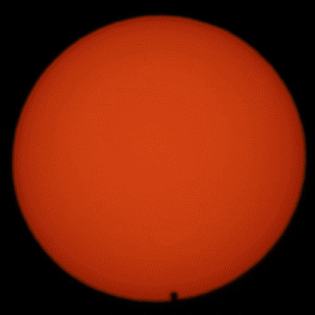

---
title:"Project 2 - Exoplanet transits"
---

# Geometry of a transit

-v-

## Depth

-v-

## Duration

-v-

## Limb Darkening

-v-

## Eccentricity?

---

# Accessing photometric data

lightkurve

---

# Detecting exoplanet transits

Exoplanets are (usually) extremely periodic. Therefore searches typically iterate through period/frequency space.

-v-

## Packages for exoplanet detection

- bls (e.g. [astropy.timeseries](https://docs.astropy.org/en/stable/timeseries/bls.html); see also [lightkurve docs](https://lightkurve.github.io/lightkurve/tutorials/3-science-examples/exoplanets-identifying-transiting-planet-signals.html))
- [transitleastsquares](https://transitleastsquares.readthedocs.io/en/latest/)
- [GerBLS](https://gerbls.readthedocs.io/en/latest/)
- [Nuance](https://nuance.readthedocs.io/en/latest/)

---
## Modelling stellar noise

- Spline (e.g. cubic bspline, implemented using e.g. scipy.interpolate)
- Filtering (e.g. Savitsky, or median filter, implemented with e.g. astropy.timeseries or scipy.signal or wotan)
- Gaussian Process (e.g. SHO, implemented with e.g. celerite or tinyGP)

---

## Other complications

-v- 

Transit timing variations

-v- 

Spot-crossing events

-v-

Stellar contamination

-v-

Atmospheric transmission

---

## How to model exoplanet transits
