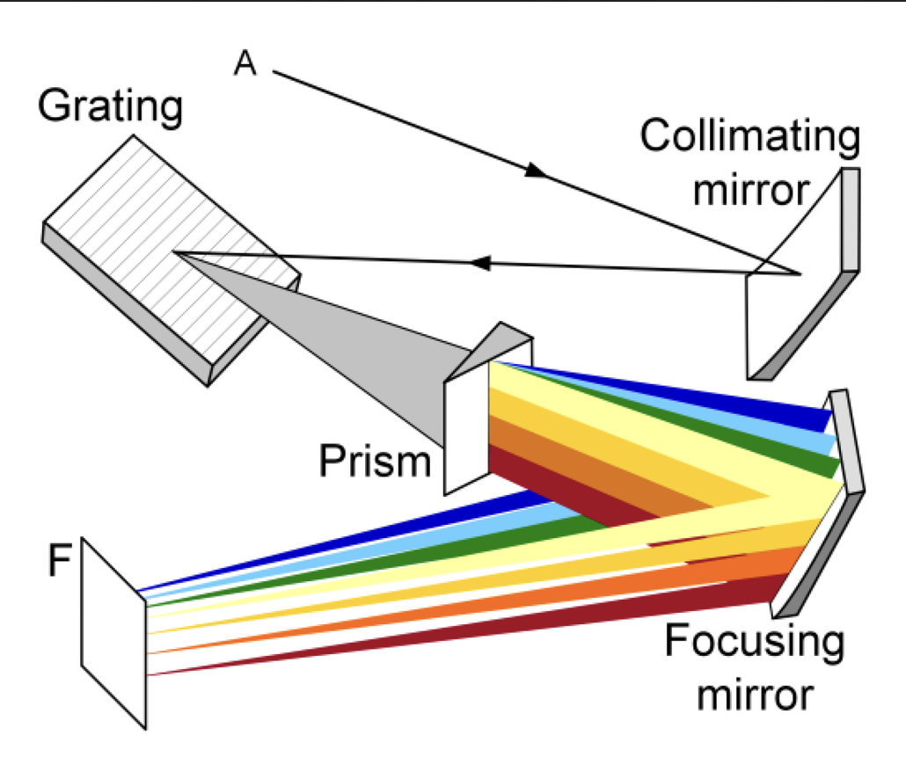
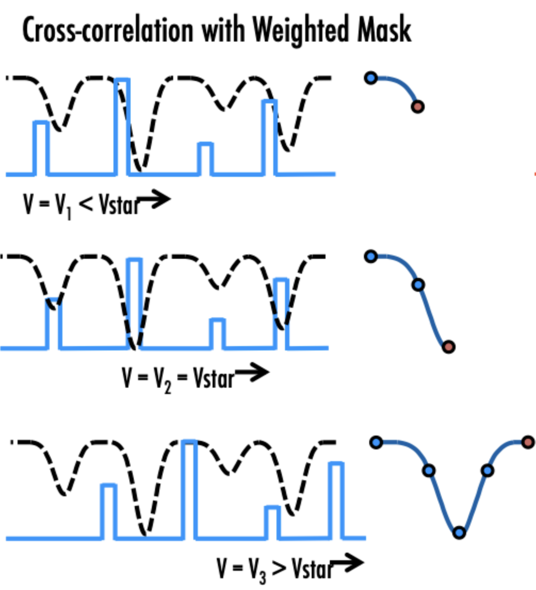
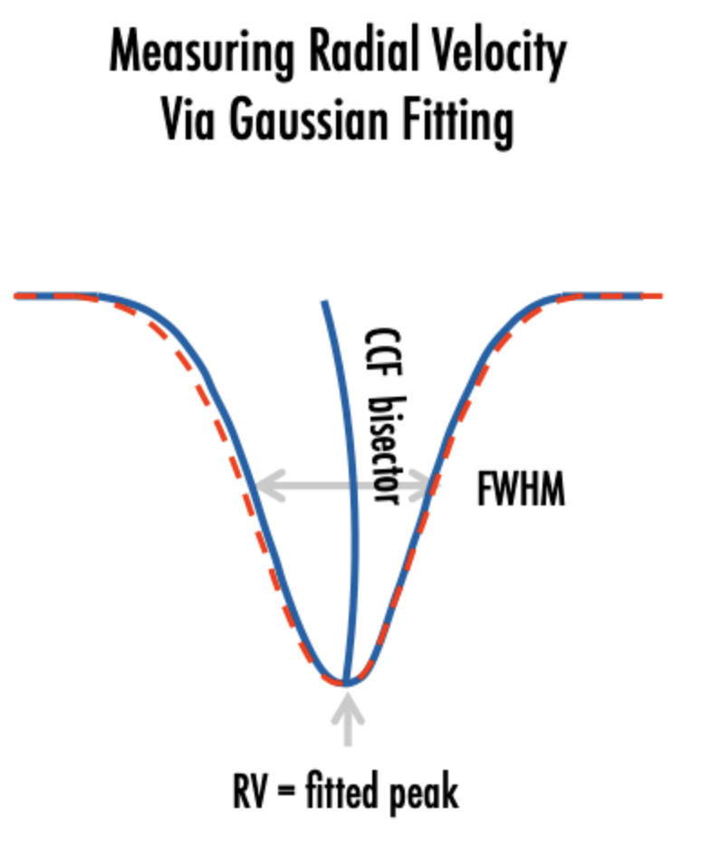
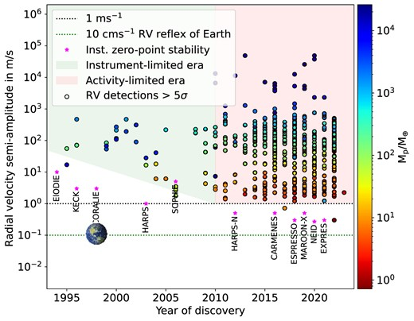
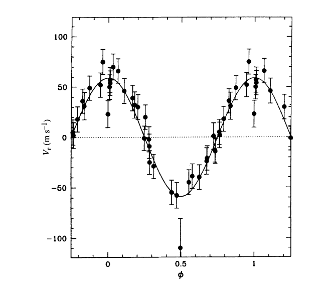
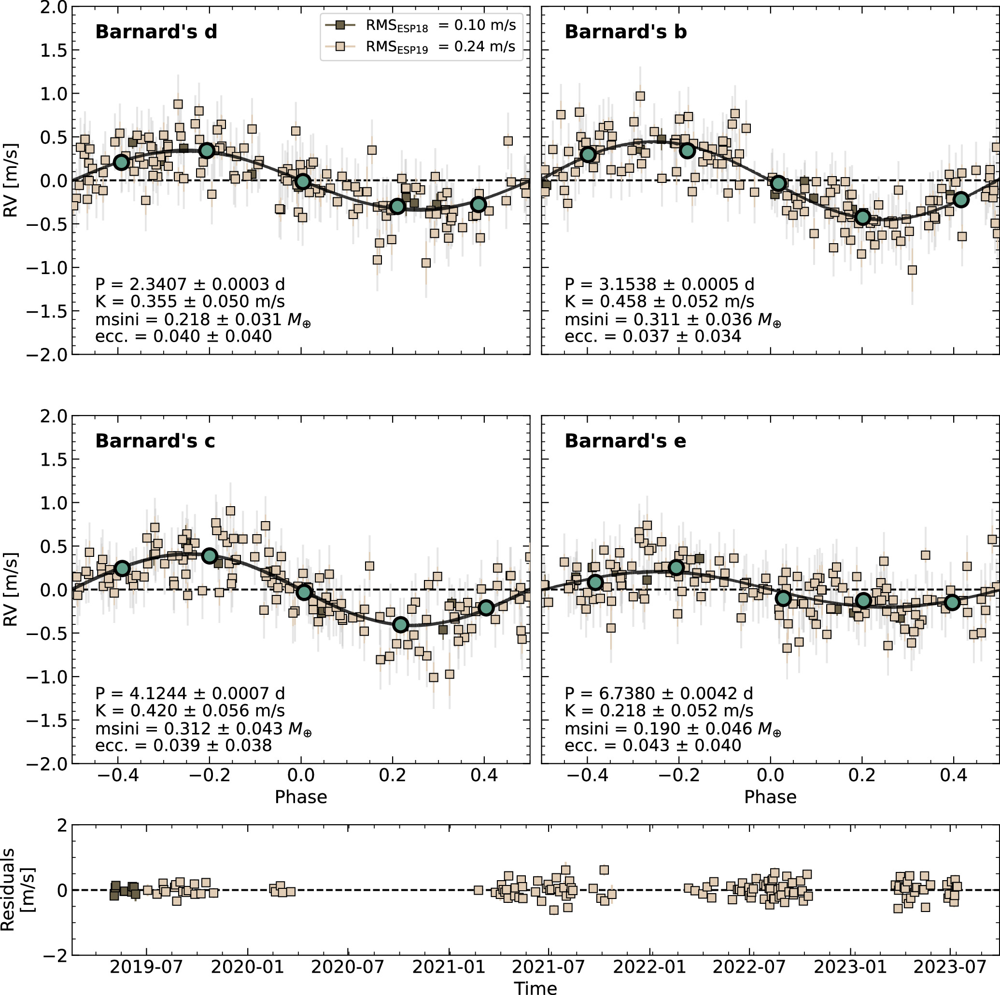
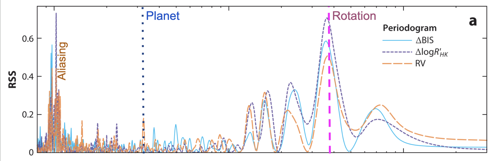
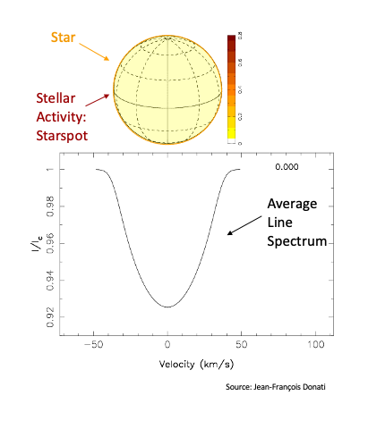
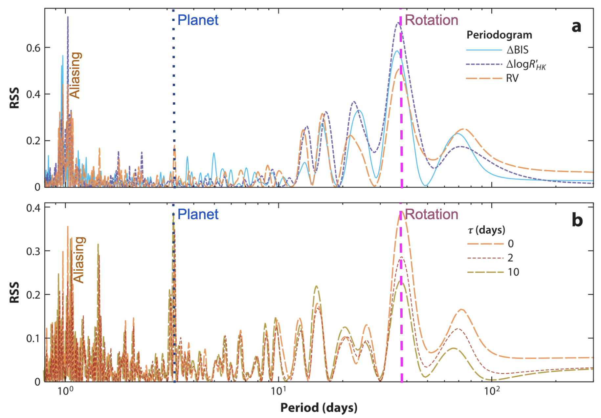

## Stellar Spectroscopy

Early spectroscopy found different spectral features and ordered A-O (with A showing the strongest Hydrogen lines)[+]

[Annie-Jump Cannon](https://en.wikipedia.org/wiki/Annie_Jump_Cannon) reordered & simplified this system, and [Cecilia Payne](https://en.wikipedia.org/wiki/Cecilia_Payne-Gaposchkin) showed the fundamentally varying parameter was **surface temperature**.

[+]
<!---->

-v-

Stars all show a mix of two things:

1) **Blackbody emission**
  - Photons escaping hot interior[+]
  - Blackbody peak set by temperature (Wien's law)[+]
  - Hot stars: bluer, cool stars: redder[+]

-v-

Stars all show a mix of two things:

2) **Absorption lines**
  - Photons pass through cooler outer layers[+]
  - Atoms and/or molecules absorb photons at specific quantum transitions (e.g. electron excitation) and reemit isotropically[+]
  - This removes flux from specific wavelengths[+]
  - Which atoms/molecules (and which transitions) absorb is dependent on temperature, composition, etc.[+]
  - Line shapes are additionally impacted by environment (surface temperature & gravity)[+]

-v-

We know _a priori_ what wavelength a set of absorption lines has _at rest_ (set by quantum mechanics).

Wavelength of absorption spectra -> the velocity of a star.[+]

Combining all spectral lines for a star (10,000s) produces the most precise possible velocity measurement.[+]

---

## Spectrographs

Modern spectrgraphs use **Echelle gratings**.

This disperses a point source (from e.g. a fibre) along one dimension.[+]

Another prism disperses the 1D light into 2D across multiple orders[+]

-v-

-v-

Modern spectrographs include HARPS, Maroon-X (on 6.5m Gemini), ESPRESSO (on 8m VLT), etc.

These are typically placed in extremely finely controlled temperature/pressure conditions to minimise thermal effects on measurements.[+]

The Echelle grating for ESPRESSO measures 1.7m in length and is kept within a 10m3 vacuum chamber[+]

---

## Resolution

Spectral resolution is defined by the smallest difference in wavelength that can be resolved

$R = \lambda / \Delta\lambda$; so for 500nm and 0.05nm $R = 500 / 0.05 = 10,000$;[+]

How does this translate to velocity? [+]

$\Delta v / c = \Delta \lambda / \lambda$ [+]

So for modern spectrographs which have $R\sim150,000$, the velocity measurement error _from a single line_ is:

$\Delta v = c/R = 3e8/1.5e5 = 2000 m/s$[+]

---

## Cross correlation

To best extract a radial velocity using all absorption lines, we correlate a "template spectrum" with a new spectrum:[+]

[+]

-v-

In reality, a **mask** which marks in & outside of absorption lines (`continuum = 0`, `line = depth`) is used.

This technique was used _before detectors_ in e.g. CORAVEL. A physical "mask" was mechanically moved in front of the spectrum within the instrument directly producing the cross correlation function from which a radial velocity could be recorded.

-v-

The resulting "Cross correlation function" is the **summed response of all absorption lines as a function of velocity**.

This easily allows radial velocity to be measured, and at a far higher precision than for a single line.[+]

-v-

You can also measure other important metrics from the CCF such as "FWHM" (line width) and "BIS" (line assymetry).

These are good indexes to measure **stellar activity** (which can also vary radial velocity).

---

## Signals in RVs

Any Keplerian motion of the star causes changes in the radial velocity.

-v-

#### What impacts the RV signal?

- Mass ratio ($K \propto M_2/M_1$)[+]
- Orbital period ($K \propto P^{1/3}$)[+]
- Orbital inclination ($K \propto \sin{i}$)[+]
- Orbital eccentricity ($K \propto (1-e^2)^{-1/2}$) [+]

-v-
Deriving the semi-amplitude:

$$
K = \frac{2 \pi a \sin{i}}{P\sqrt{1-e^2}} = \left(\frac{2 \pi G}{P}\right)^{1/3} \frac{M_p \sin{i}}{(M_s + M_p)^{2/3}} \frac{1}{\sqrt{1-e^2}}
$$

-v-

In more detail, we can derive it more completely:

1) The ratio in semi-major axes ($a_p/(a_p + a_s)$) is the inverse of the mass ratio ($m_p/(m_p + m_s)$). i.e. $a_s/(a_p + a_s) = m_p/(m_p + m_s)$[+]

2) Angular motion gives us orbital speed of a star/planet (assuming $e=0$): $K_p = v_s = \frac{2\pi a_s}{P}$; substituting for $a_s$, $K_p = \frac{2\pi}{P}\frac{(a_p+a_s) m_p}{m_p + m_s}$[+]

3) Kepler's third law $a^3 = G(m_p+m_s)P^2/4\pi^2$ (NB this uses relative motion, i.e. $a=(a_p+a_s)$) produces: $K_p = \frac{2\pi}{P}\frac{m_p}{m_p + m_s}\left(\frac{G(m_p+m_s)P^2}{4\pi^2}\right)^{1/3}$[+]

4) Simplifying gives: $K_p = \left(\frac{2\pi G}{P}\right)^{1/3}\frac{m_p}{(m_p + m_s)^{2/3}}$[+]

5) To adjust to _projected_ radial velocity we must include $\sin{i}$

-v-

### Improvement over time:

[Burt et al](https://arxiv.org/html/2511.01954v1)

-v- 

### Examples 1995 - Hot Jupiters

$K=60\,\rm{m}.\rm{s}^{-1}$

-v- 

### Examples 2026 - sub-Earth planets

---

## Detecting RV planets

Keplerians are **periodic**, so typically found by searching in frequency space, e.g.:
- [Lomb Scargle](https://iopscience.iop.org/article/10.3847/1538-4365/aab766)
- [Generalised LS](https://arxiv.org/abs/1412.0467)
- [L1 periodogram](https://github.com/nathanchara/l1periodogram)

-v-

---

## Stellar Activity

-v-

- Starspots are **cooler** regions on stars where convection is suppressed
- Faculae are **hotter** regions (more sparsely concentrated)
- Activity **rotates with the stellar surface** 
- Stellar rotation typically 5-50d (Sun: 27d)[+]

-v- 

We can measure additional signals linked to activity, and remove their influence on the RVs.

Tecniques includes simple decorrelation, or more complex Gaussian Processes.

---
